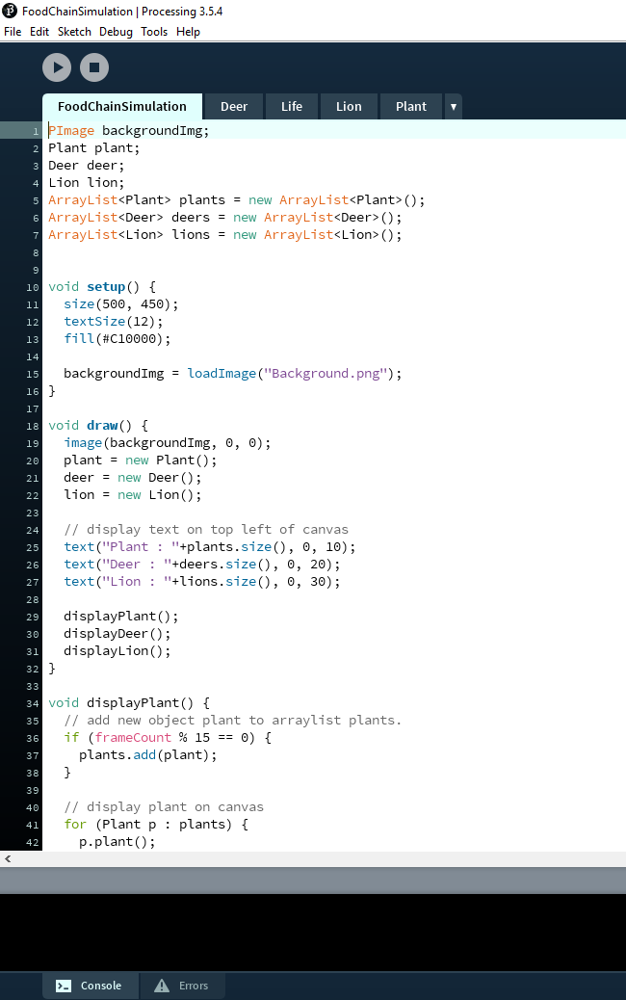
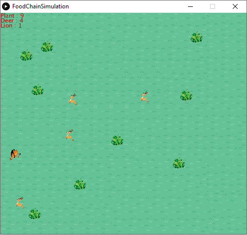
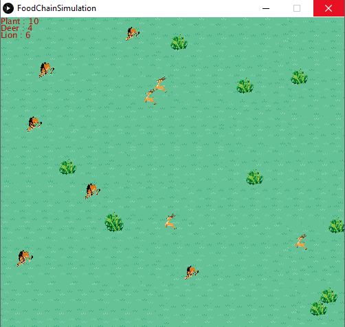

<!DOCTYPE html>
<html>

<head>
 
</head>

<body style="background-color:rgb(50,50,50); color:white">
<table width= 100%>
  <tr>
    <td class="infotd">
      <h3>Hardik Narotam</h3>
      
 
	  Namaste, I am currently a undergraduate student at City University of London. I am really passionate about programming and finding solutions and creating something with coding is just amazing.
	  
 
    </td>
    <td>
	</img>
    </td>
  </tr>
  <tr>
    <td colspan=2>
	

    </td>
  </tr>

 <tr>
  <td class="infotd">
    <h3>Bootcamp 2020: Food Chain Simulation</h3>
    

	My first programming project, concluding the 2 week Programming Bootcamp at 
	City (2020). This Processing project demonstrates a comprehensive understanding 
	of the use of arrays, loops, and randomness. I created a forest scene in which 
	details of each tree (e.g. position, trunk color and size, crown color and shape) 
	are stored in parallel 2D arrays. Trees are arranged in a regular grid but their 
	positions are jittered by  small random offsets to create the impression of a real 
	forest. Similarly, each tree trunk and crown has a individual color shade, obtained
	using  random variations of brown and green. Finally, the forest changes over time:
	trees grow and their crowns become more pale to suggest seasonal change ( from 
        spring to autumn).
    

    

      Check out the code on Github: <a href="https://github.com/cityteaching/bootcamp-portfolio-HardikNarotam/tree/main/project">https://github.com/cityteaching/bootcamp-portfolio-HardikNarotam/tree/main/project</a>
    

  <td>
	<video width="429" height="200" controls>
	<source src="https://web.microsoftstream.com/video/8f00f8dc-48bb-44c8-8258-501a1172a211" type="video/mp4">
	</video>
  <td>
  </td>
<tr>
 <td colspan = 2 align=center>
	
	
	
 </td>
</tr>
 </tr>
</table>
</body>
</html>
